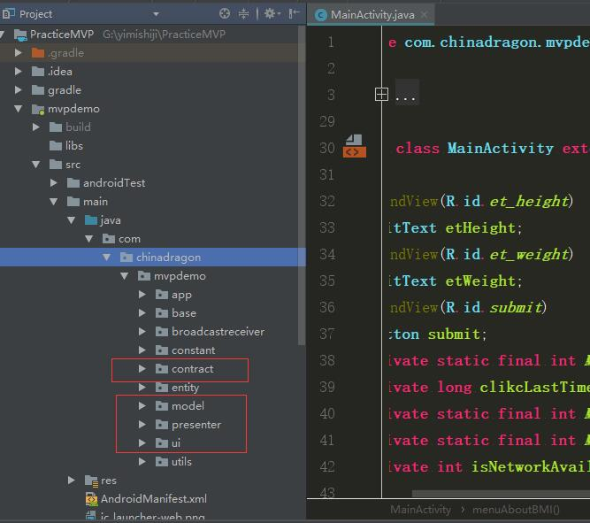
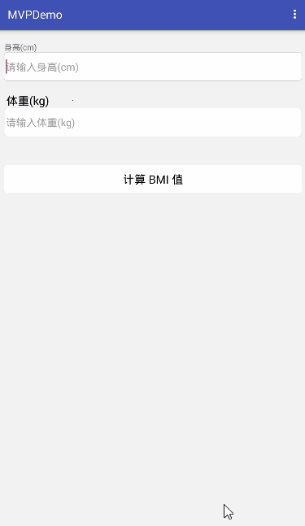

# Android MVP模式--简单实用示例（BMI） 
  
## MVP简介
> MVP全称：Model、View、Presenter； 
> 
- View：负责视图部分展示
- Model：负责数据的请求、解析、过滤等数据层操作。
- Presenter：View和Model交互的桥梁。

## demo里结构图

  

## demo演示效果图

  

### **[Demo源码下载](https://github.com/ChinaDragon01/PracticeMVP.git)**